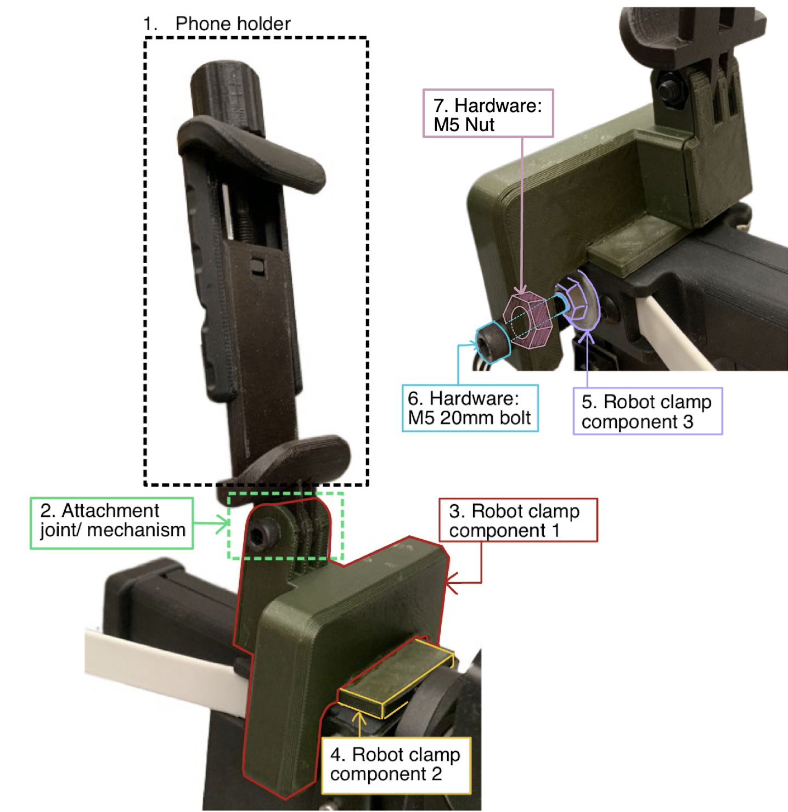
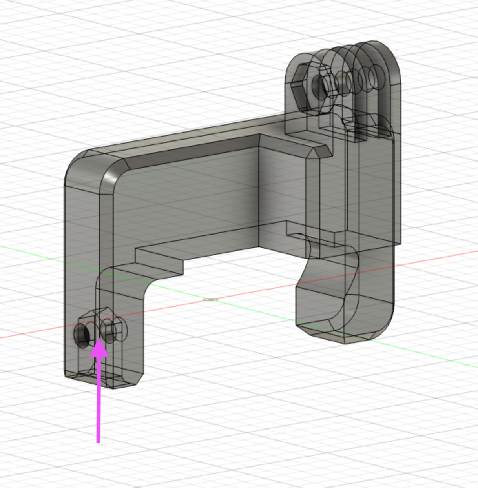

# HelloRobot_Stock
#### * This repository is a work in progress
These designs were made for collecting data and running expirements with the [Hello Robot Stretch](https://hello-robot.com/product) using an iPhone as an egocentric camera. For data collection the iPhone was mounter to a manual grabber tool, and calibrated to be at the same perspective. Over time the design has been adjusted to fit the specific setup by adjusting height and setback of the clamps, so the final desgins as well as the original, non-adjusted designs will be included. If set up correctly, the non-adjusted designs will have the camera at the same position relative to the grabber tips on both the robot and the grabber stick. 

## [Bill of Materials](https://docs.google.com/spreadsheets/d/1qkDV2W64Q2eQ5Y6DkTYfokI8hO4we7ong_2VNufDRaY/edit?usp=sharing) 

## Phone Holder
### The phone holder is taken from the [Modular Mounting System by HeyVye](https://www.thingiverse.com/thing:2194278), which is licensed under the [Creative Commons - Attribution](https://creativecommons.org/licenses/by/4.0/) license.

It uses the Mount Phone Clamp, and the print files, print instructions, and instructions for assembly are all on the linked page. The files are also provided in the folder [PhoneHolder](PhoneHolder/)

For the hardware, instead of a printed bolt and nut, a M5 35mm bolt and a M5 nut for better durability and performance. 

The attachment joint/mechanism is taken from this system, but it is important to note that within the system the joint is inspired from a gopro mount joint, so it will work with a standard gopro mount as well. There is more on this in the [Attachment Joint/Mechanism](#attachment-jointmechanism) section. 

<!-- [PhoneClamp_body1.stl](PhoneHolder/PhoneClamp_body1.stl)

[PhoneClamp_body2.stl](PhoneHolder/PhoneClamp_body2.stl)

[PhoneClamp_Knob.stl](PhoneHolder/PhoneClamp_Knob.stl) -->
## Robot Clamp

### Part Files
1. [Phone Holder](#phone-holder)
2. [Attachment joint/mechanism](#attachment-jointmechanism)
3. Clamp Component 1: [robotClamp.stl](RobotClamp/robotClamp.stl)
4. Clamp Component 2: [robotClamp_insert.stl](RobotClamp/robotClamp_insert.stl)
5. Clamp Component 3: [robotClamp_pad.stl](RobotClamp/robotClamp_pad.stl)

### Hardware and other items for assembly
6. 1 x M5 20mm bolt, socket head
7. 1 x M5 nut
- [Gorilla Super Gel Glue](amazon.com/Gorilla-7700108-2-Pack-Super-Clear/dp/B00OAAUAX8?source=ps-sl-shoppingads-lpcontext&ref_=fplfs&smid=ATVPDKIKX0DER&th=1)

### Assembly Instructions
1. Print necessary files. Each respective file folder contains suggested print, support, and orientation settings. 
2. Assemble phone holder using instructions in the [Phone Holder](#phone-holder) section. 
3. Take the robot clamp components 1 and 2 ([robotClamp.stl](RobotClamp/robotClamp.stl) and [robotClamp_insert.stl](RobotClamp/robotClamp_insert.stl)), add super glue to the underpart of component 1 in which component 2 can be inserted into. 
4. Press component 2 into component 1 where the glue has been applied, such that component 2 is centered and equal amounts stick out from the clamp. Hold down for at least 15 sec. (Note that the glue takes around a day to fully set)
5. Insert nut into slot as shown in image

6. Insert screw/bolt into hole, thread through the nut that was inserted into clamp at step 5, and once the end is visible, thread the silver end pad([Robot clamp component 3](RobotClamp/robotClamp_pad.stl)) onto the end of the screw. 

## Grabber Clamp

[grabberClamp_body.stl](GrabberClamp/grabberClamp_body.stl)

### Part Files
1. [Phone Holder](#phone-holder)
2. [Attachment joint/mechanism](#attachment-jointmechanism)
3. [Grabber Clamp Component 1](GrabberClamp/grabberClamp_top.stl)
5. [Grabber Clamp Component Top and Bottom](GrabberClamp/grabberClamp_body.stl)

### Hardware
4. 2 x M5 10mm bolts
6. 4 x M5 nuts
7. 4 x M5 12mm bolts

### Assembly Instructions
1. Print necessary files. Each respective file folder contains suggested print, support, and orientation settings. 
2. Take 

## Grabber Ends
## Attachment Joint/Mechanism
## Full Picture
