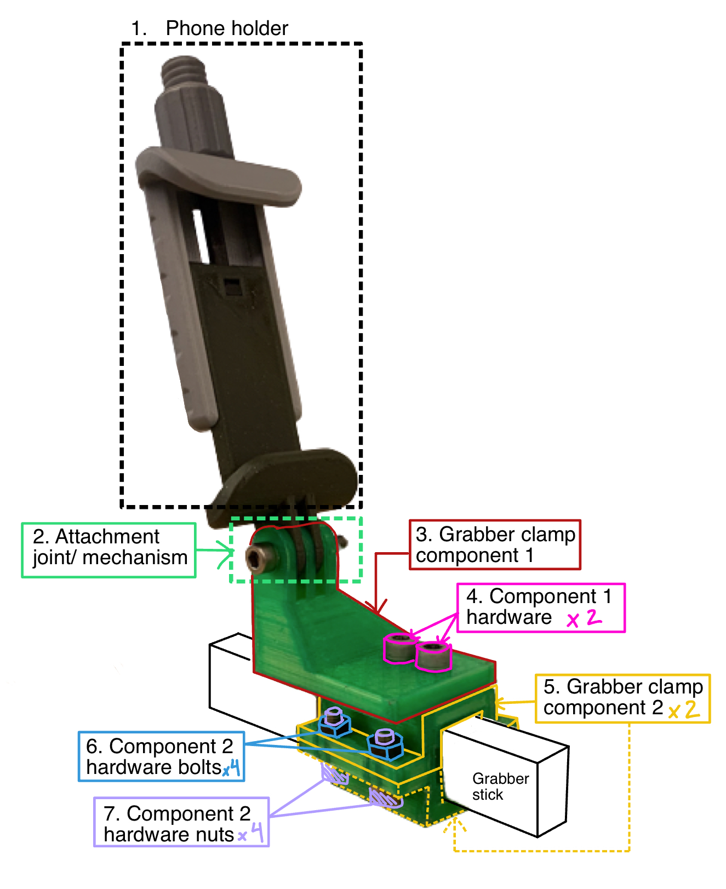

# HelloRobot_Stock
#### * This repository is a work in progress
## Phone Holder
### The phone holder is taken from the [Modular Mounting System
by HeyVye](https://www.thingiverse.com/thing:2194278), which is licensed under the [Creative Commons - Attribution](https://creativecommons.org/licenses/by/4.0/) license.

It uses the Mount Phone Clamp, and the print files, print instructions, and instructions for assembly are all on the linked page. The files are also provided in the folder [PhoneHolder](PhoneHolder/)

<!-- [PhoneClamp_body1.stl](PhoneHolder/PhoneClamp_body1.stl)

[PhoneClamp_body2.stl](PhoneHolder/PhoneClamp_body2.stl)

[PhoneClamp_Knob.stl](PhoneHolder/PhoneClamp_Knob.stl) -->
## Robot Clamp

### Part Files
1. [Phone Holder](#phone-holder)
2. [Attachment joint/mechanism](#attachment-jointmechanism)
3. Clamp Component 1: [robotClamp.stl](RobotClamp/robotClamp.stl)
4. Clamp Component 2: [robotClamp_insert.stl](RobotClamp/robotClamp_insert.stl)
5. Clamp Component 3: [robotClamp_pad.stl](RobotClamp/robotClamp_pad.stl)

### Hardware and other items for assembly
6. 1 x M5 20mm bolt, socket head
- [Gorilla Super Gel Glue](amazon.com/Gorilla-7700108-2-Pack-Super-Clear/dp/B00OAAUAX8?source=ps-sl-shoppingads-lpcontext&ref_=fplfs&smid=ATVPDKIKX0DER&th=1)

### Assembly Instructions
1. Print necessary files. Each respective file folder contains suggested print, support, and orientation settings. 
2. Assemble phone holder using instructions in the [Phone Holder](#phone-holder) section. 
3. Take the robot clamp components 1 and 2 ([robotClamp.stl](RobotClamp/robotClamp.stl) and [robotClamp_insert.stl](RobotClamp/robotClamp_insert.stl)), add super glue to the underpart of component 1 in which component 2 can be inserted into. 
4. Press component 2 into component 1 where the glue has been applied, such that component 2 is centered and equal amounts stick out from the clamp. Hold down for at least 15 sec. (Note that the glue takes around a day to fully set)

## Grabber Clamp

[grabberClamp_body.stl](GrabberClamp/grabberClamp_body.stl)

## Grabber Ends
## Attachment Joint/Mechanism
## Full Picture
